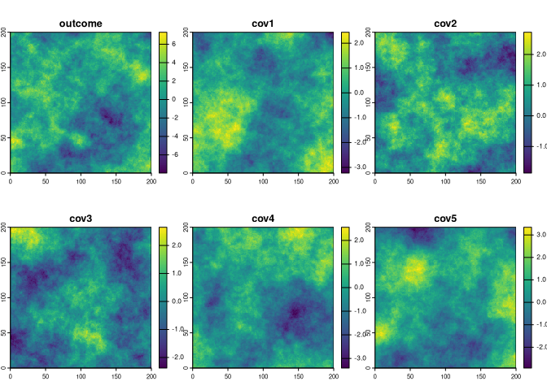
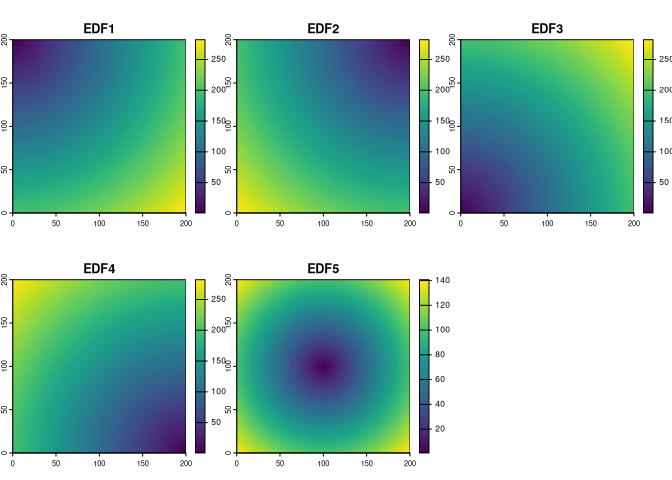
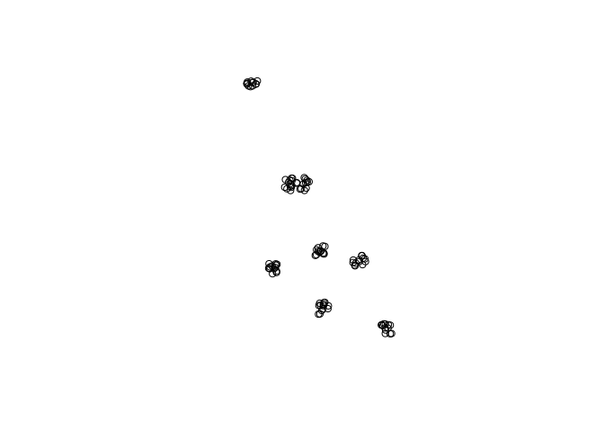

<!-- README.md is generated from README.Rmd. Please edit that file -->

# simsam

<!-- badges: start -->

[](https://lifecycle.r-lib.org/articles/stages.html#experimental)
<!-- badges: end -->

The goal of **simsam** is to provide tools for simulating and sampling
spatial data. It additionally provides tools for creating various
spatial proxies.

## Installation

You can install the development version of **simsam** from
[GitHub](https://github.com/) with:

``` r
# install.packages("pak")
pak::pak("Nowosad/simsam")
```

## Examples

Let’s start by loading the packages and creating a raster object that
will serve as a grid template for the simulations.

``` r
library(simsam)
library(terra)
rast_grid = terra::rast(ncols = 200, nrows = 200, 
                        xmin = 0, xmax = 200, ymin = 0, ymax = 200)
```

### Spatial data simulation

The `sim_field()` function simulates a spatial field with covariates
based on the provided arguments.

``` r
sim_rast = sim_field(rast_grid, 100, scenario = "autocor", n_covariates = 5)
plot(sim_rast)
```



### Creating spatial proxies

The `make_proxy()` function creates various spatial proxies (e.g.,
coordinates, Euclidean Distance Fields (EDF), and Oblique Geographic
Coordinates (OGC)) based on the provided input raster.

``` r
proxy_edf = make_proxy(sim_rast, "edf")
plot(proxy_edf)
```



### Sampling spatial data

The `sam_field()` function samples a spatial field based on the provided
arguments.

``` r
set.seed(2024-12-04)
sample_c1 = sam_field(rast_grid, 100, "clustered", nclusters = 8, value = 5)
plot(sample_c1)
```



## Contribution

Contributions to this package are welcome - let us know if you have any
suggestions or spotted a bug. The preferred method of contribution is
through a GitHub pull request. Feel also free to contact us by creating
[an issue](https://github.com/nowosad/simsam/issues).
